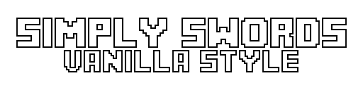

# 

## 

This Resource pack change visual of all *(not yet)* weapons added by this mod:

This is very good mod, but weapons does not fit in minecraft look.  
So i create my own textures and models.

## 

> All weapons are in *iron*, *gold*, *diamond*, *netherite* ans *runic* version

- Chakram
- Claymore
- Cutlass
- Greataxe
- Greathammer
- Katana
- Longsword
- Rapier
- Scythe
- Spear
- Sai
- Twinblade
- Warglaive

## 

I am going to add **~~runic~~** and **unique** weapons.  
Also i want to add support weapon variants from:

